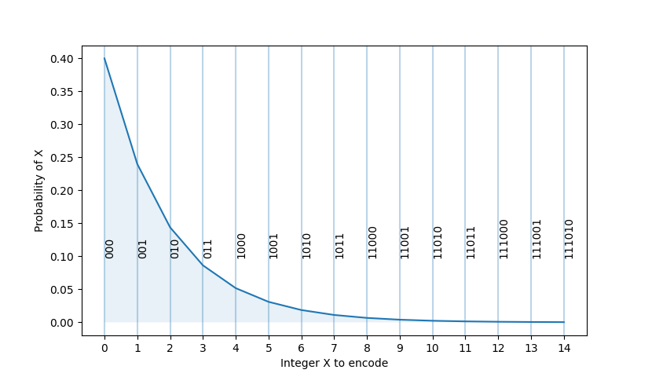
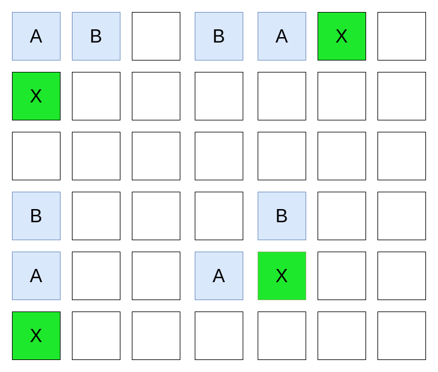
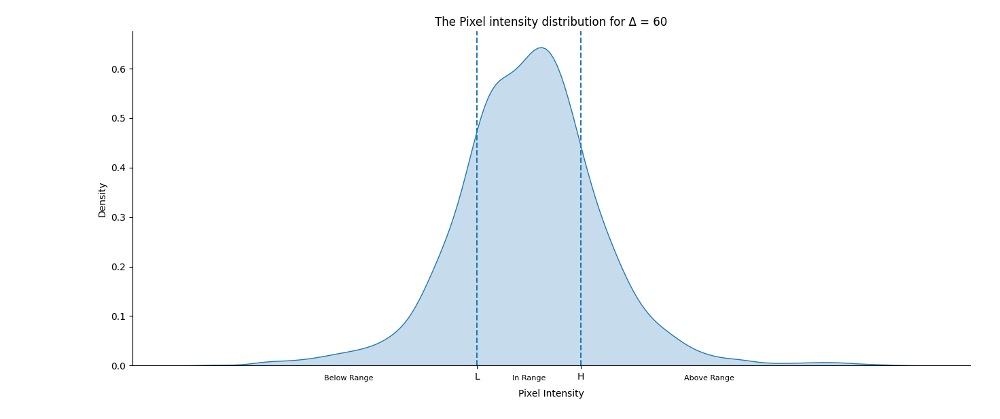
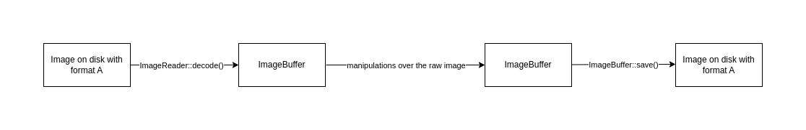
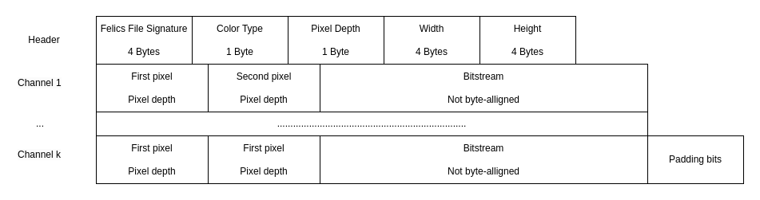

# A new lossless image format based on FELICS 

## Introduction

[TODO]

In this paper, I will describe a new image format with lossless compression that is very simple yet efficient. My plan is to use FELICS [6](Howard & Vitter, 2002) as a method of compressing grayscale images. I will then generalize this method to also compress RGB images and add support for both 8-bit and 16-bit pixel depths.

In the end, there should be a specification for the new image format, tools to convert from other image formats to the new format and backward, and a library that allows users to compress/decompress images from their code.


## Preliminaries

### Data compression 

Data compression is the process of reducing the number of bits required to encode information.
It is particularly useful for reducing storage costs and enables transmission over limited bandwith channels. 
Data compression can be lossless or lossy. 

As the name suggests, lossless compression allows the reconstruction of data from the compressed data without losing any information. Lossless compression is often used when no difference between the original data and the reconstructed data is tolerated [1](Sayood, 2006, p. 4).  

On the other hand, data that has been compressed using lossy compression cannot be reconstructed exactly. This may not be a problem in some applications. For example, a small quality loss when reconstructing audio files may be tolerated by a human listener. 

### Image compression 

Image compression refers to data compression applied to digital images. 
Images carry a huge amount of information and can occupy a significant amount of disk space. 

On the internet, they also take up to 65% of most webpages [2](Compression Techniques, n.d.). Therefore, good image compression algorithms can speed up page rendering, reduce bandwitdh and save battery life for mobile devices. 

There are both lossless and lossy methods of compressing images. Lossy image compression might be unsuitable for a number of tasks like medical imaging [3](Wong et al., 1995), satelite imagery and scientific illustrations and diagrams.
This paper will focus on a lossless compression scheme.

### What makes images compressible

[TODO]

### File formats

A file format defines how data inside a file is  arranged. This includes things like how text characters are encoded, or how audio is stored as digital waveforms. An image format is a file format for a digital image.

The image format dictates how pixels are stored in a file. Image data can be stored compressed or uncompressed. Examples of popular image formats are: PNG, JFIF, WEBP, QOI, BMP and TIFF.

Image formats may use lossless or lossy compression. 
For example, the PNG standard specifies that the compression should preserve all information [4](Portable Network Graphics (PNG) Specification (Second Edition), n.d.). JFIF, on the other hand, uses JPEG compression, which can be either lossless or lossy.

### Codes 

In information theory, a code refers to a system of mapping symbols or strings of symbols to codewords, where each codeword is a string of bits. For text data, symbols may be individual characters like letters, numbers and punctuation. For image data, symbols could represent individual pixels in an image.

Using codes, we can map any information into a bitstring. The length of the bitstring depends on the quality of the code and the probabilities of the individual symbols [5].
For example, the ASCII code uses the same number of bits to encode each symbol. If we know that some symbols occur more often, we may use a code that assigns shorter codewords to the common symbols and longer codewords to the rare symbols so that on average, messages use fewer bits. 

In this paper, we will use two types of codes: Golomb-Rice codes and Phased-In codes.

#### Golomb-Rice codes

Golomb codes are a type of code specifically suited for integers where larger values have a lower probability of occurence [7]. More specifically, Golomb codes work best when the source alphabet follows a geometric distribution. They have a tunable parameter $M$ that can be adjusted so that the code better matches the specific probability distribution of the integers in our data. 

The next figure shows the golomb bitwords generated for integers in $[0, 14]$, using $M = 4$. The geometric distribution used has $p = 0.4$. 



Rice codes are a sub-category of Golomb codes in which the constraint $M = 2^K$ is added, so $M$ must be a power of two. Rice codes are more convenient for use on a computer, since we can use binary arithmetic for fast encoding and decoding.

To encode an integer, we first remove its $K$ least significant bits and encode the remaining number in unary. Then, we simply output its $K$ least significant bits directly.

#### Phased-In codes

Unlike Golomb-Rice codes, Phased-In codes were developed to encode data where individual symbols have equal probabilities. The issue with assigning bitwords of length $\lceil log_2n\rceil$ for symbols of an alphabet of size $n$ is that some codewords will not be used. For example, if $n=100$, we may assign each symbol a codeword of size $\lceil log_2n\rceil = 7$, but we will only use 100 out of 128 codewords. 

The solution described in [8] splits the $n$ symbols into two sets. If $2^m<=n < 2^m+1$, the first set will receive codewords of size $m+1$, and the second set codewords of size $m$. We denote them with $A$ and $B$. Their sizes will be computed like so:

$$
|A| =  2*n-2^{m+1} , |B| =  2^{m+1} - n
$$

Notice that $n = |A| + |B|$, so the two sets cover the entire alphabet. It's important to note that the average codeword length will be between $m$ and $m+1$ bits, so codewords will be shorter on average, especialy when there are more short codewords.

We will look now look at an example where we want to encode integers in the range $[0, 27)$. There are 27 integers, so $n=27$. We calculate $m$ to be $\lfloor log_227 \rfloor = 4$. Therefore, $|A| = 2*27 - 2^5 = 22$, $|B| = 2^5 - 27 = 5$ 
Integers in the range $[0, 5)$ will receive codewords of size 4, while integers in the range $[5, 27)$ will receive codewords of size 5.


The following table shows the codewords of the integers in the range $[0, 27)$.

| Integer | Codeword | Integer | Codeword | Integer | Codeword | 
| --- | --- | --- | --- | --- | --- |
| 0   | 0000 | 10 | 11101 | 20 | 00111
| 1   | 1000 | 11 | 00010 | 21 | 10110
| 2   | 0100 | 12 | 00011 | 21 | 10111
| 3   | 1100 | 13 | 10010 | 23 | 01110
| 4   | 0010 | 14 | 10011 | 24 | 01111
| 5   | 10100 | 15 | 01010 | 25 | 11110
| 6   | 10101 | 16 | 01011 | 26 | 11111
| 7   | 01100 | 17 | 11010 | 
| 8   | 01101 | 18 | 11011 |
| 9   | 11100 | 19 | 00110 |

### FELICS 

FELICS, which stands for "fast and efficient lossless image compression system", works by modeling the distribution of a pixel's intensity value using the values of its two nearest neighbours that have already been visited. 

FELICS proceeds by coding pixels their in raster-scan order. This means that FELICS traverses the image line by line, from the left to the right. Therefore, the two nearest neighbours of a pixel are usually the one above and the one to the left of the current pixel. 



*Figure shows the various possible configurations for the neighbouring pixels (A and B) of a given pixel (X)*

In the context of a grayscale image, each pixel has a single intensity value, $V$. For images with multiple channels, each pixel may be represented by multiple intensity values. For example, an RGB image has three channels: red, green and blue. We can think of a pixel as a triplet $(R, G ,B)$, with an intensity value for each channel.
Since the algorithm only works for grayscale images, a pixel will only have one intensity value. 

To encode a pixel $P$, the algorithm looks at the two neighbouring pixels and their intensities. The smaller neighbouring value is called $L$, and the larger value $H$. Next, we compute $\Delta = H - L$, the prediction context of $P$. The coding proceeds as follows:

<pre>
if  L <= P <= H    
    use one bit to encode IN-RANGE 
    encode the value P - L in the range [0, Δ] using a truncated binary code 
if P < L
    use one bit to encode OUT-OF-RANGE
    use one bit to encode BELOW-RANGE 
    encode the value L-P-1 using Golomb-Rice codes 
if P > H
    use one bit to encode OUT-OF-RANGE
    use one bit to encode ABOVE-RANGE 
    encode the value P-H-1 using Golomb-Rice codes 
</pre>

The first two pixels in the image are outputed without coding. The steps above are then repeated for every pixel in the image, in raster-scan order.

The algorithm assumes that if a pixel $P$ is in the range $[L, H]$, its value follows a uniform distribution. Conversely, if $P$ is out-of-range, its value must follow a geometric distribution. These assumptions are why we use Golomb-Rice and Phased-in codes to encode pixel intensities. 

We can understand why these assumptions where made by analyzing the distribution of intensities of pixels for each context $\Delta$. Intensities are generally distributed as shown in the next figure.

In-Range intensities can be modeled using a uniform distribution without a significant overhead in bitword length, so Phased-In codes are used. Because there is a small crest in the middle, we assign the shorter codewords to the values near the middle of the interval $[L, H]$. The probability of out-of-range intensities falls of sharply the further we move away from the interval $[L, H]$ so it is reasonable to use Golomb-Rice codes. 


*The figure was generated using 5 8-bit grayscale images. The images are included in the annex.*

### Reversible color transform

Digital images often store color information using multiple channels. Usually, each pixel holds three color values: red, green and blue, denoting a coordinate in the RGB color space. We can compress an RGB image by applying a grayscale compression algorithm on each channel independently, but this is not efficient for natural images. It has been shown [9] that the RGB color space exhibits a high statistical corelation between the color components.
We can exploit this by mapping the image from the RGB color space into a space in which the components are uncorrelated. 

We want to achieve losless image compression, so the color transform needs to be lossless too. A good solution is described in [10], which introduces the YCoCg color space.
The linear operation that maps coordinates in the RGB space to coordinates in the YCoCg space is defined as follows:

```math
\begin{bmatrix} Y \\ Co \\ Cg \end{bmatrix} = \begin{bmatrix} 1/4 & 1/2 & 1/4 \\ 0 & -1 & 1 \\ 1 & -1 &0 \end{bmatrix} * \begin{bmatrix} R \\ G \\ B \end{bmatrix}
```

The inverse of this operation is defined as follows:

```math
\begin{bmatrix} R \\ G \\ B \end{bmatrix} = \begin{bmatrix} 1 & -1/4 & 3/4 \\1 &-1/4&-1/4\\ 1 &3/4&-1/4\end{bmatrix} * \begin{bmatrix} R \\ G \\ B \end{bmatrix}
```

We can also use the lifting tehnique described in [10] to make the transform lossless.

## My contribution 

Building on the theoretical foundation laid out in the previous chapter, this chapter delves into the technical issue of implementing the new image format. I will describe how these techniques come together to make it all work.  

[TODO: insert summary]

### Choosing the right programming language

Data compression is a usually a computationally intensive task, so we would like to implement our image format using a language that is fast. The C programming language is a good example of a low-level language that provides the means to writing fast compression algorithms because it is compiled ahead of time and allows us to manually manage allocated memory. More control over the memory layout can be beneficial for cache locality [10].  
A downside of the C programming language is that it's potentially memory unsafe. It allows arbitrary pointer arithmetic and does not have bounds checking. 

The lack of bounds checking when accessing memory presents a significant security risk. This is particularly exploited in the context of data compression, where malicious actors can craft data specifically designed to trigger buffer overflows during the process of encoding or decoding.

For example, a bug in the library "libwebp" allowed an attacker to create a malformed WebP file that contained an invalid Huffman tree [11]. This lead to a heap buffer overlow, making it possible to execute arbitrary code on a vulnerable system.

A better choice is the Rust programming language. Like C, it compiles ahead of time so the compiler can emit optimized code that runs fast. Moreover, the rust compiler refuses to compile any code that contains memory-related bugs. For these reasons, I chose to implement the image format using the Rust programming language.

### Project structure

When implementing an image format, the project is usually split up into two parts: a library that exports important functions used in reading and writing to and from image files, and a set of tools that use the library to implement basic functionalities. 
For example, the open source library to use in applications that create, read, and manipulate PNG image files is called "libpng"[13]. The library is developed alongside many tools like:

- "pnm2png" - Program that is used to convert a "pnm" file to a "png" file.
- "png2pnm" - Program that is used to convert a "png" file to a "pnm" file.
- "cvtcolor" - Program that converts images from a format to another given format (for example grayscale to RGB).

Examples of functions provided in the "libpng" library are:

- "png_read_png" - For reading the entire image into memory.
- "png_read_info" - For reading only the file information.
- "png_write_image" - For writing the image from memory.


My project will be structured similarly, the objective being to create a Rust package that contains a library crate and multiple binary crates implementing programs that use the library.

### The felics library crate

#### The API
To begin, I have decided that the library should satisfy the following requirements:
 - The API should be as simple as possible and provide great flexibility.
- The library should correctly handle both RGB and grayscale image formats.
- It should also correctly handle 8-bit and 16-bit pixel depths.
- It should provide a function that compresses a given image from memory to a specified location (be it a file on the disk or a buffer in memory). 
- It should also provide a function that decompresses a compressed image (from a file on disk or a buffer in memory) and returns the decompressed image.
- It should allow reading metadata information about the image without actually decompressing it. This includes data like the image's color format, pixel depth, width, and height.

To acheive points 4 and 5, I need to decide what data structure will constitute the image that the users will pass/receive to/from the library API. In other words, I need to define what an "image" is from the library's point of view. For this, I have decided to use the Rust "image" crate [14]. 

The "image" crate was created to provide methods to convert to and from various image formats.  It also defines the "ImageBuffer" structure, which holds the actual raw pixel data. The following figure shows a flowchart of what can be achieved using the "image" crate.




The "felics" library will use the ImageBuffer structure in the definitions of the compression and decompression functions. This means that users of the "image" crate can easily use the library's API, without needing to do the work of converting the "ImageBuffer" to our version of the data structure. Compatibility with the "image" crate is also the goal of other Rust image compression crates, such as "turbojpeg" [15]. 

The "ImageBuffer" is also parametrized by pixel types, so the library can potentially handle every possible combination of pixel format and bit depth. The following block of code illustrates how I implement the "CompressDecompress" trait for the RGB and grayscale image formats.  

```rust
impl<T> CompressDecompress for ImageBuffer<Luma<T>, Vec<T>>
where
    Luma<T>: Pixel<Subpixel = T>,
    T: Intensity,
{
    /// Trait implementation
}

impl<T> CompressDecompress for ImageBuffer<Rgb<T>, Vec<T>>
where
    Rgb<T>: Pixel<Subpixel = T>,
    T: Intensity,
{
    /// Trait implementation
}
```

The "Subpixel" type represents the scalar type that is used to store each channel in a pixel. For example, this can be "u8", "u16", "f32" etc. We restrict this type to the "u8" and "u16" types, through our definition of the "Intensity" trait. This means that we will handle only 8-bit and 16-bit pixel depths.

The "CompressDecompress" trait is implemented by all image types that are supported by the felics compression algorithm. It is defined in the following block of code.

```rust
pub trait CompressDecompress {
    fn compress<W>(&self, to: W) -> Result<()>
       where W: Write;

    fn decompress<R>(from: R) -> Result<Self, DecompressionError>
       where Self: Sized,
             R: Read; 
}
```

Ultimately, the library api is defined in the following block of code:

```rust
pub fn compress_image<W, T>(to: W, image: T) -> Result<()>
where
    W: Write,
    T: CompressDecompress

pub fn decompress_image<R>(from: R) -> Result<DynamicImage, DecompressionError>
where
    R: Read

pub fn read_header<T>(from: T) -> Result<Header, DecompressionError>
where
T: Read,
```

It is worth mentioning that we return a "DynamicImage" when decompressing an image from a source. This is because we can't know beforehand what the image type will be. The "DynamicImage" type is just an enumerator over all possible image types. The user will use Rust's pattern matching to handle the dynamic image appropriately.

The header is a structure that holds metadata information about the image. I will describe it in more detail when I introduce the image format. 

#### Bit operations

As we will use Golomb-Rice and Phased-In codes, I need to introduce a method of writing individual bits to a sink and also reading individual bits from a source. Processing individual bits is also required to read and write the IN-RANGE, and OUT-OF-RANGE markers (felics section). Eventually, we will encode our image using a stream of bits.

For this, I have decided to use the "bitstream-io" [16] Rust crate. The "bitstream-io" library is very flexible and can wrap around any stream that implements the Read or Write traits. This means that we can write individual bits to buffers in memory, files on disk, or any other sink that implements the Write trait, and also read individual bits from any source that implements the Read trait.

In the context of writing bits, the library works by buffering a single byte. When pushing a bit, it toggles the corresponding bit in the buffered byte and increments the bit count. If the buffered byte is full after pushing a bit, it will be written to the sink and the bit count reset to 0. Note that it's important to pad the stream of bits so that it becomes byte-aligned before flushing it to the sink. A similar approach is used when reading bits from a source.

I chose to use the big-endian bit order for reading and writing bits. This means that more significant bits are read or written before the lesser significant bits.
The following code block illustrates how the "bistream-io" library is used to encode the per-pixel range markers.

```rust
fn encode_range<T>(bitwrite: &mut T, intensity: PixelIntensity) -> io::Result<()>
where
    T: BitWrite,
{
    match intensity {
        PixelIntensity::InRange => bitwrite.write_bit(true)?,
        PixelIntensity::AboveRange => {
            bitwrite.write_bit(false)?;
            bitwrite.write_bit(true)?;
        }
        PixelIntensity::BelowRange => {
            bitwrite.write_bit(false)?;
            bitwrite.write_bit(false)?;
        }
    }
    Ok(())
}

/// Reads a `PixelIntensity` from the given `BitRead`.
fn decode_range<T>(bitread: &mut T) -> io::Result<PixelIntensity>
where
    T: BitRead,
{
    let in_range = bitread.read_bit()?;
    if in_range {
        return Ok(PixelIntensity::InRange);
    }
    let above = bitread.read_bit()?;
    if above {
        return Ok(PixelIntensity::AboveRange);
    }
    Ok(PixelIntensity::BelowRange)
}
```

#### Compressing a single color-channel

Now that I have described how we can emit individual bits, I will go into detail about compressing a single color channel.
The compression process will follow the detailed approach outlined in the FELICS chapter. 

Since we're operating on a single channel, we're essentially traversing a 2D matrix of scalar values and emitting bits to encode each value. 
I have chosen to use the simpler Rice codes over Golomb codes because the latter are slower and only give a marginal improvement over the other, as shown in [6].
At each step of the algorithm, if the current pixel intensity $P$ falls outside the range $[L, H]$, we must choose a Rice parameter $k$ to encode $L-P-1$ if $P$ is below the range and $P-H-1$ otherwise. A good Rice parameter will encode this value with as few bits as possible. It is not possible to enumerate all reasonable Rice parameters and choose the optimal one, because the parameter selection must be done during decoding also. It's also important to note that the first two pixels of the image are always emitted without coding.  

The parameter selection method I implemented uses multiple ideas described in [6]:
- For each context $\Delta$, I will maintain for each possible parameter value $k$, the length of the code that would have been obtained if all values encountered so far in the context were encoded using $k$. 
- At each step, we choose the parameter $k$ with the smallest cumulative code length in the current context
- In case of equality, choose the larger parameter $k$ so that we avoid encoding large intensities with a small coding parameter
- Halve the cumulative code lengths in a context when the smallest one reaches $1024$

The following pseudocode illustrates how the parameter selection works at each step:

```
context  = H - L

k = GetRiceParameterFor(context)

if L <= pixel <= H
    EncodeMarker(IN_RANGE)
	EncodePhasedIn(context, pixel - L)

if pixel < L 
    EncodeMarker(BELOW_RANGE)
	EncodeRice(L - pixel - 1, k)
	UpdateTableForContext(L - pixel - 1, context)

if pixel > R
    EncodeMarker(ABOVE_RANGE)
	EncodeRice(pixel - H - 1, k)
	UpdateTableForContext(pixel - H - 1, context)
```

Since we work with both 8-bit and 16-bit color channels, it's sensible to use different ranges for the Rice parameters k based on the number of bits used per pixel.  
For example, we might encode 8-bit values by picking a k value from the set $ \{0, 1, 2 ,3 , 4 ,5, 6, 7\} $. There's no use in choosing a k value greater than 6 because then the performance of the Rice coder is the same as coding the value in its plain binary form.

We can search for the best possible sets for the Rice parameter k by some experimentation. I have created a dataset consisting of 40 8-bit grayscale images and 10 16-bit grayscale images. The images were selected from the USC-SIPI image database[18]. My idea is to apply the compression algorithm using various sets for the Rice parameter k and select the set that produces the highest compression ratio. 
The two following tables show the results for both 8-bit and 16-bit pixel depths.

| Possible values for k  (8-bit) |   [0, 5] |  [0,6] | [0, 4] | [0,3] | [0,2] | [1, 5] | [2, 5] |
|         ---             |    ---   |   ---  | --     | --    |  ---  |   ---  | ----   |
|    Uncompressed size (bytes)| 15089704 | * | * | * | * | * | * |
|    Compressed size (bytes)  | 8529509  | 8530013 | 8529804 | 8531913 | 8563203 | 8602668 | 8748943 |
| Compression ratio |  1.76911  |   1.76901 |1.76905 | 1.76861 | 1.76215 |  1.75407 | 1.72474 


| Possible values for k (16-bit)  |   [0, 14]  |  [0,12] | [0, 10] | [0,9] | [1,11] | [3, 11] | [4, 11] | [5, 11] | [6, 11] |
|         ---             |    ---     |   ---   | --      | --     |  ---   |   ---  | ----    |   ---   |   ---   |
|    Uncompressed size (bytes)    |  11136568    |    *    |       * |      * |      * |      * | *       |   *     |    *    |
|    Compressed size (bytes) | 7543288  | 7542507 | 7546086 | 7636332 | 7542209 | 7542196 | 7542120 |    7542011 | 7543104 | 
| Compression ratio (16-bit)  |  1.47635 |  1.47650 | 1.47580 | 1.45836 |  1.47656 | 1.47656 | 1.47658 |  1.47660 | 1.47639 | 

We can observe a couple of things. 
- For the 8-bit grayscale images, the best compression ratio was achieved using k-values from the range $[0,5]$. 
- For the 16-bit grayscale images, the best set of k-values is the range $[5, 11]$. 
- The compression ratio of 16-bit images is significantly lower than that of 8-bit images. 
- For the 8-bit images, having $k=0$ be a valid choice leads to better compression overall, while for the 16-bit images, it leads to lower performance. This can be explained by the fact that small values of $L-P-1$ or $P-H-1$ are less probable when using 16-bit scalar values.

#### The image format

While I've explained how the compression algorithm emits a stream of bits, this bitstream alone is insufficient to reconstruct the original image. To implement the decompression algorithm, I need to establish the image format. The decompression process depends on the bit-depth of the initial image to choose the set of valid values for the Rice parameter k, so it's critical to include metadata information about the image in the compressed representation. Also, the decompression algorithm needs to know the width, height, and color type of the original image.

The following diagram describes the FELICS image format.



The FELICS file header consists of the FELICS file signature [17], the color type of the image, the pixel depth, and the dimensions of the image. 
The point of the file signature is to provide information to the operating system or any other program about the content of the file. In this case, it tells the operating system that the file contains compressed image data produced by the felics algorithm. The "magic bytes" chosen for the file signature encode the string "FLCS" in ASCII.

The color type can be either 0 for grayscale images or 1 for RGB images. It's encoded using 1 byte so that I can easily extend the supported color types in the future. The pixel depth can be either 0 for 8-bit images or 1 for 16-bit images. The image dimensions are represented by the two 4-byte unsigned integers: Width and Height. These values are written in big-endian. 

As stated before, for each channel we output the first two pixels unencoded. Following the first two pixels is the actual bitstream encoding the rest of the image channel. This bitstream may not be byte-aligned, meaning we might emit a number of bits that is not a multiple of 8 (the number of bits in a byte). 
If multiple channels are present, we continue emitting bits for the next channel. If no channel remains, we must pad the bitstream with zero bits to become byte-aligned.

#### Decompressing a single color-channel

The decompression algorithm is very similar to the compression algorithm. It starts by reading the felics header to work out the image metadata information. Once it knows the image dimensions, the decompression algorithm allocates an appropriately sized buffer to hold the raw image pixel data. 

Then, it reads the values of the first two pixels and writes them to the buffer. Like the compression algorithm, it traverses the buffer in the raster-scan order but sets the value of each pixel by reading from the bitstream. 

When decoding an OUT-OF-RANGE value, we need to know the Rice parameter $k$ that was used when encoding it. Luckily, because the compression algorithm is deterministic, we can simulate the same process of updating the parameter selection tables while we decode the image. We can prove by induction that during decompression we will produce the same $k$ parameters that were used for compression.

- Induction hypothesis: During processing of the first n pixels in the image, both the compressor and the decompressor will choose the same Rice parameters at each step

- Base case: The first time we must choose a Rice parameter $k$ is to encode the third pixel in the image. At this time, the table used for determining the optimal Rice parameter for the current context is full of zeros. Therefore, both the compressor and decompressor will choose the largest valid k value (see chapter above).

- The inductive step: Suppose that the induction hypothesis is true. This means that at each previous step, the compressor and the decompressor have chosen the same parameter $k$. This means that the first $n$ pixels that were encoded by the compressor were correctly decoded by the decompressor, so the tables for each context $\Delta$ match. Therefore, at step $n+1$ the compressor and the decompressor will choose the same Rice parameter.

The resulting decompression step looks like this:
```
context  = H - L
marker = DecodeRange()

k = GetRiceParameterFor(context)

if marker is IN_RANGE 
	pixel = DecodePhasedIn(context) + L

if marker is BELOW_RANGE 
    v = DecodeRice(k)
	UpdateTableForContext(v, context)
    pixel = L - v - 1

if marker is ABOVE_RANGE 
    v = DecodeRice(k)
	UpdateTableForContext(v, context)
    pixel = v + H +1
```

#### Handling multiple color channels

The naive way of compressing multiple color channels is to emit bits for each channel independently. This solution is trivial and the implementation requires no explanation, but it doesn't consider the statistical correlation between the red, green, and blue channels (see section about color transforms).

A superior approach would first apply a color transform over the initial image. 
I have described the YCoCg color space and how it may improve compression by reducing the correlation between components. I have also mentioned that it fits our needs because it can be losslessly reversed. 

A downside is that if we want to apply this transform over an image of bit depth $n$, the resulting image will have a bit depth of $n+1$ for the Co and Cg channels. This complicates the implementation because in Rust we can only use a couple of scalar types: (u8, u16, i16, u32 etc). 

For the sake of simplicity, I first convert the image data to a 32-bit format. In other words, the image content itself isn't altered, just how it is stored in memory. I chose 32 bits because it's the smallest scalar type that can hold 17 bits.
Each pixel intensity will now be interpreted as a signed 32-bit integer because it's possible to obtain negative values after the color transform. For example, the RGB triplet $(231, 27, 30)$ will be converted to $(79, 201, -103)$. After we apply the transform, we can encode each channel independently. During decompression, we must apply the reverse transform to the channels after we have decoded them. 

The following table illustrates how adding a color transform affects the size of the compressed images. The test images were selected from the USC-SIPI  image database.

|   Image     |   Without the color transform (bytes) | With the color transform  (bytes) |
| ----        |    ----                               | ---                               |
|    house    |                 109047                |                 105741            | 
|    peppers  |                 504372                |                 512290            |     
|    tree     |                 130166                |                 122246            |
|    lena     |                 118186                |                 110707            |
|    sailboat |                 544998                |                 545539            |
|    mandril  |                 639373                |                 617524            |
|    airplane |                 413706                |                 385832            |

On average, the color transform reduces the compressed image size by around 5%.

## Bibliography
1) Sayood, K. (2006). Introduction to data compression (3rd ed.). Elsevier.

2) Compression techniques. (n.d.). Google for Developers. https://developers.google.com/speed/webp/docs/compression

3) Wong, S. L., Zaremba, L., Gooden, D. S., & Huang, H. K. (1995). Radiologic image compression-a review. Proceedings of the IEEE, 83(2), 194–219. https://doi.org/10.1109/5.364466

4) Portable Network Graphics (PNG) Specification (Second Edition). (n.d.). https://www.w3.org/TR/2003/REC-PNG-20031110/

5) Salomon, D. (2007). Variable-length codes for data compression. In Springer eBooks. https://doi.org/10.1007/978-1-84628-959-0

6) Howard, P. G., & Vitter, J. S. (n.d.). Fast and efficient lossless image compression. In [Proceedings] DCC '93: Data Compression Conference. [Proceedings] DCC '93: Data Compression Conference. IEEE Comput. Soc. Press. https://doi.org/10.1109/dcc.1993.253114

7) Golomb Codes. (2018). In Introduction to data compression. https://doi.org/10.1016/c2015-0-06248-7

8) David Solomon, Phased-In codes. https://www.davidsalomon.name/VLCadvertis/phasedin.pdf

9) Cui, K., Boev, A., Alshina, E., & Steinbach, E. (2021). Color image restoration exploiting Inter-Channel correlation with a 3-Stage CNN. IEEE Journal of Selected Topics in Signal Processing, 15(2), 174–189. https://doi.org/10.1109/jstsp.2020.3043148

10) Grunwald, D., Zorn, B., & Henderson, R. (1993, June). Improving the cache locality of memory allocation. In Proceedings of the ACM SIGPLAN 1993 conference on Programming language design and implementation (pp. 177-186).

11) Uncovering the Hidden WebP vulnerability: a tale of a CVE with much bigger implications than it originally seemed. (2024, February 6). The Cloudflare Blog. https://blog.cloudflare.com/uncovering-the-hidden-webp-vulnerability-cve-2023-4863

12) Introduction - The Rust Programming language. (n.d.). https://doc.rust-lang.org/book/ch00-00-introduction.html

13) pnggroup. (n.d.). GitHub - pnggroup/libpng: LIBPNG: Portable Network Graphics support, official libpng repository. GitHub. https://github.com/pnggroup/libpng

14) Crates.io: Rust package Registry. (n.d.). crates.io: Rust Package Registry. https://crates.io/crates/image

15) Crates.io: Rust package Registry. (n.d.-b). crates.io: Rust Package Registry. https://crates.io/crates/turbojpeg

16) Crates.io: Rust package Registry. (n.d.-c). crates.io: Rust Package Registry. https://crates.io/crates/bitstream-io

17) Wikipedia contributors. (2024, June 6). List of file signatures. Wikipedia. https://en.wikipedia.org/wiki/List_of_file_signatures

18) SIPI Image Database. (n.d.). https://sipi.usc.edu/database/
